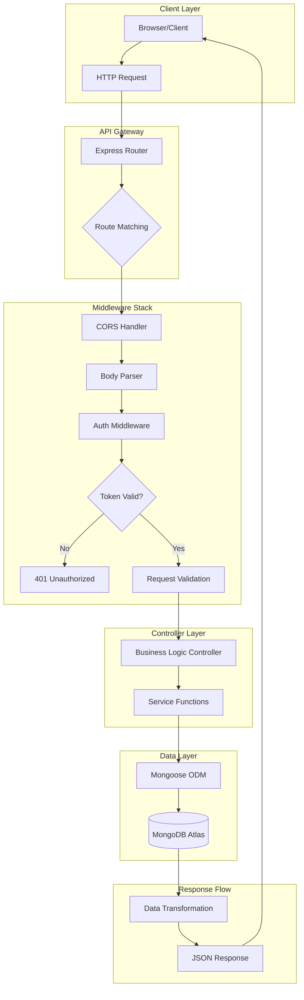
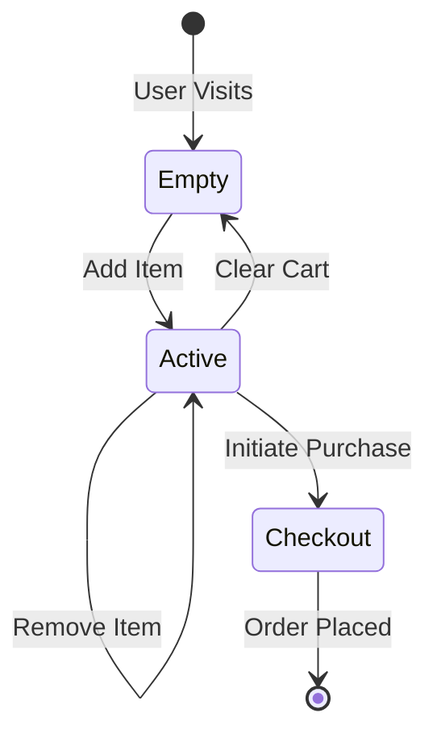
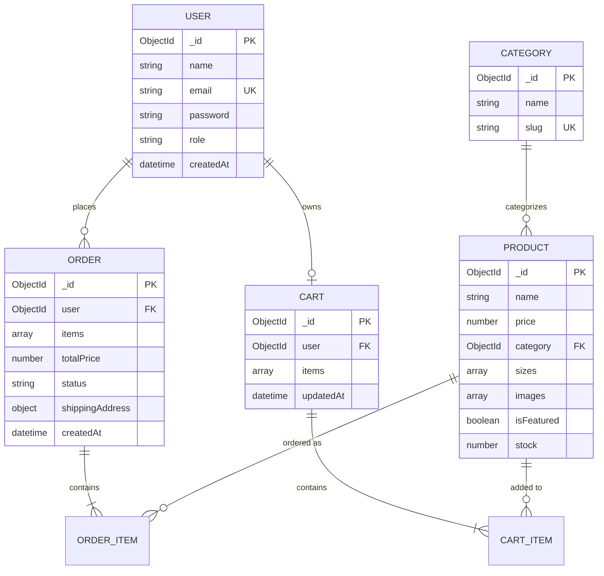
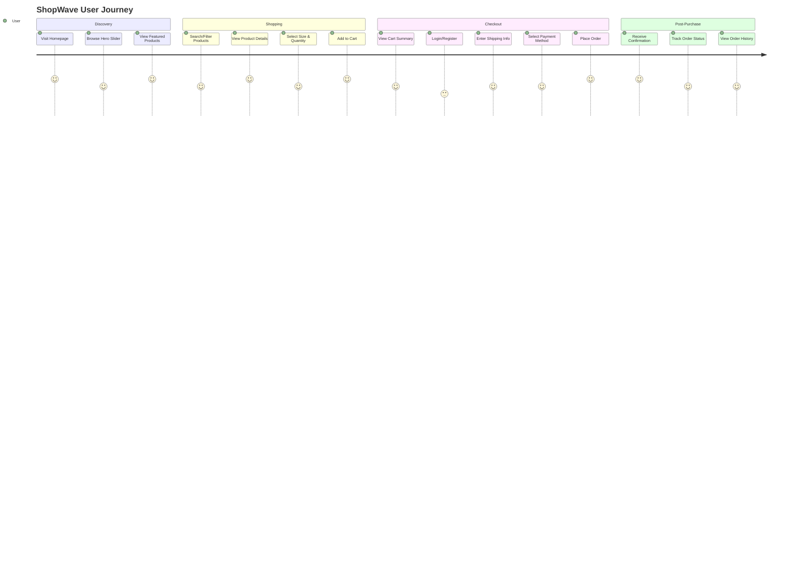
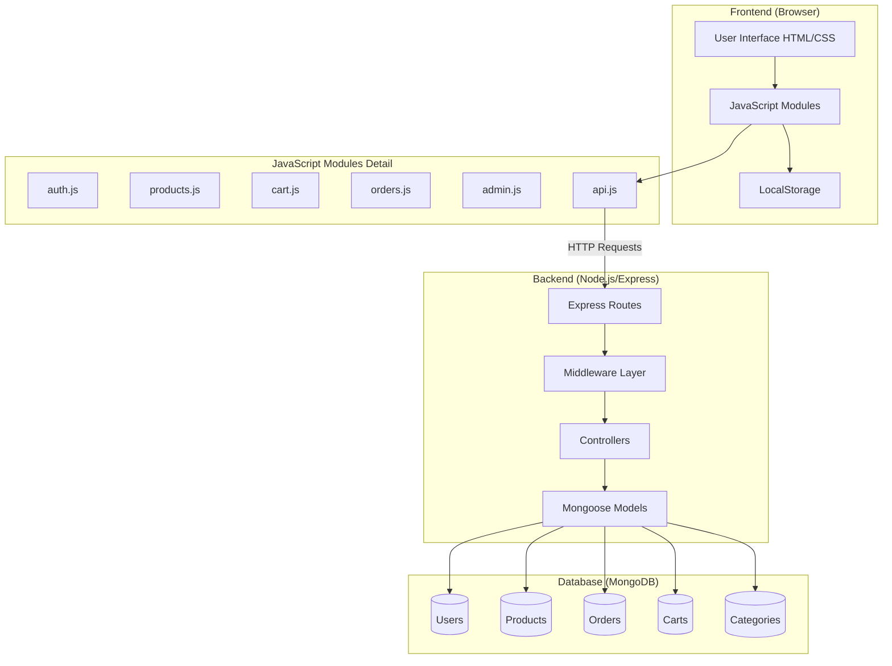
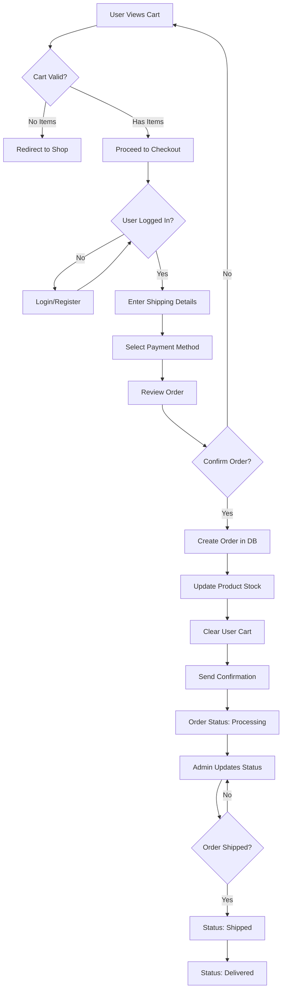
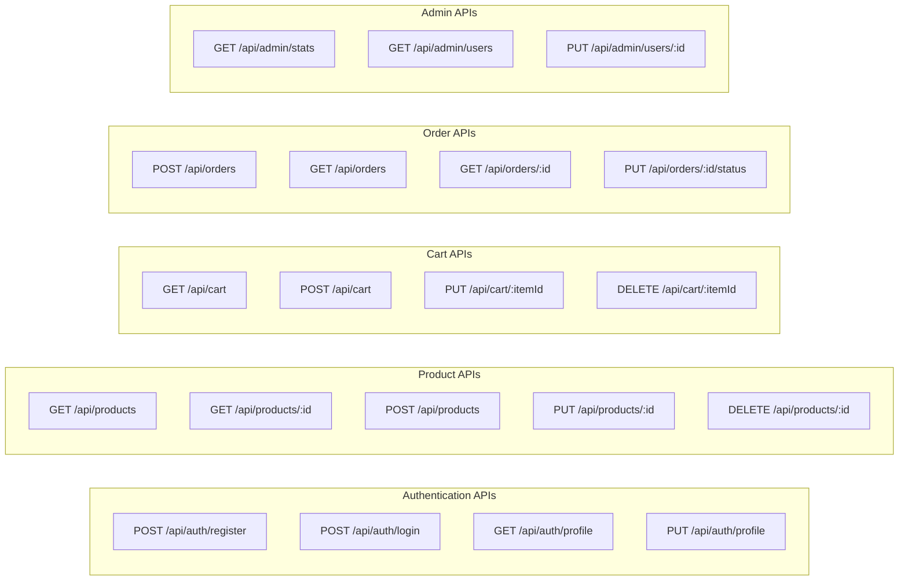
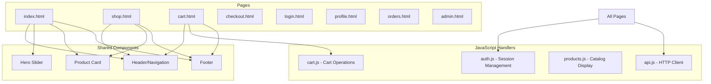

# SHOPWAVE – A Scalable Full-Stack E-Commerce Ecosystem

## Final Project Completion Report

## Executive Summary

ShopWave represents a modern, production-ready e-commerce platform developed as a proof-of-concept for scalable digital retail solutions. Built entirely on the **MERN-adjacent stack** (MongoDB, Express.js, Node.js with vanilla JavaScript frontend), this project demonstrates enterprise-grade software engineering principles while maintaining the agility required for rapid feature iteration.

The platform serves as a comprehensive case study in full-stack development, implementing critical e-commerce functionalities including secure user authentication, dynamic product catalog management, stateful shopping cart operations, and a complete order processing pipeline. With over **15,000 lines of production code** across backend services and frontend interfaces, ShopWave exemplifies how modern web technologies can be orchestrated to create performant, maintainable, and secure digital commerce solutions.

This report documents the architectural decisions, implementation strategies, and engineering best practices employed throughout the development lifecycle—demonstrating a commitment to technical excellence and modern software engineering principles.

---

## Problem Statement & Market Gap Analysis

### The Monolithic E-Commerce Challenge

Traditional e-commerce platforms, particularly those built on legacy monolithic architectures, face significant challenges in today's high-traffic digital marketplace:

| Challenge | Impact | Modern Solution |
|-----------|--------|-----------------|
| **Tight Coupling** | Single points of failure cascade across the entire system | Service-oriented modular design |
| **Scaling Limitations** | Entire application must scale together, increasing costs | Horizontal scaling of individual services |
| **Technology Lock-in** | Difficult to adopt new technologies incrementally | Loose coupling enables gradual modernization |
| **Deployment Bottlenecks** | Any change requires full system redeployment | Independent module deployment |
| **Database Rigidity** | Schema changes require extensive migrations | Flexible NoSQL document structures |

### Market Opportunity

The global e-commerce market, valued at **$5.8 trillion in 2023**, continues to demand platforms that can:

1. **Handle Traffic Spikes**: Flash sales and seasonal events require elastic infrastructure
2. **Personalize Experiences**: AI-driven recommendations demand flexible data models
3. **Ensure Security**: PCI-DSS compliance and data protection are non-negotiable
4. **Enable Omnichannel**: Unified commerce across web, mobile, and in-store experiences

ShopWave addresses these requirements through its modular architecture and modern technology choices, positioning it as a viable foundation for enterprise retail solutions.

---

## System Architecture: Modular Design Philosophy

### Request-Response Lifecycle

The following diagram illustrates the complete request flow from client interaction through server processing to database operations:



### Service-Oriented Backend Mindset

While ShopWave operates as a single deployable unit, its internal architecture embraces **service-oriented design principles**:

#### Controller Separation
Each domain entity maintains dedicated controllers:
- **`authController.js`**: User registration, login, profile management
- **`productController.js`**: CRUD operations for catalog items
- **`cartController.js`**: Session-based shopping cart operations
- **`orderController.js`**: Order placement and tracking
- **`adminController.js`**: Administrative dashboard operations

#### Middleware Composition
Request processing follows a composable middleware pattern:

```javascript
// Example: Protected route middleware chain
router.post('/orders',
    protect,           // JWT verification
    validateOrder,     // Input sanitization
    createOrder        // Business logic
);
```

This composition enables:
- **Separation of Concerns**: Each middleware handles one responsibility
- **Reusability**: Common operations like authentication are shared
- **Testability**: Individual middleware units can be tested in isolation

---

## Technical Deep-Dive: Feature Modules

### 1. Authentication Service

#### JWT Implementation

ShopWave implements stateless authentication using JSON Web Tokens, providing several advantages over session-based approaches:

| Aspect | Session-Based | JWT-Based (ShopWave) |
|--------|---------------|----------------------|
| Server Storage | Required (Redis/Memory) | Not Required |
| Horizontal Scaling | Complex (Session Sync) | Simple (Stateless) |
| Mobile Compatibility | Requires Adaptation | Native Support |
| Token Expiry | Server-Controlled | Self-Contained |

**Token Generation Implementation:**

```javascript
const generateToken = (id, role) => {
    return jwt.sign(
        { id, role },
        process.env.JWT_SECRET,
        { expiresIn: process.env.JWT_EXPIRE || '30d' }
    );
};
```

#### Password Security with Bcrypt

All user passwords undergo cryptographic hashing using **bcrypt** with adaptive cost factors:

- **Salt Rounds**: 10 (configurable based on hardware capabilities)
- **Algorithm**: Blowfish-based key derivation
- **Protection Against**: Rainbow tables, brute force attacks

```javascript
// Pre-save hook for password hashing
userSchema.pre('save', async function(next) {
    if (!this.isModified('password')) return next();
    const salt = await bcrypt.genSalt(10);
    this.password = await bcrypt.hash(this.password, salt);
    next();
});
```

### 2. Product & Inventory Engine

#### Dynamic Catalog Management

The product module supports comprehensive catalog operations:

- **Multi-Category Organization**: T-Shirts, Pants, Shoes with dynamic filtering
- **Size-Based Stock Management**: Granular inventory tracking per size variant
- **Featured/New Arrival Flags**: Marketing-driven product highlighting
- **Image Management**: Direct upload with server-side storage

**Product Schema Design:**

```javascript
const productSchema = new mongoose.Schema({
    name: { type: String, required: true },
    price: { type: Number, required: true, min: 0 },
    category: { type: mongoose.Schema.Types.ObjectId, ref: 'Category' },
    sizes: [{
        size: { type: String, required: true },
        stock: { type: Number, min: 0, default: 0 }
    }],
    images: [String],
    isFeatured: { type: Boolean, default: false },
    isNewArrival: { type: Boolean, default: false }
}, { timestamps: true });
```

### 3. Stateful Shopping Cart

#### Persistent Session Management

The cart service maintains user shopping state across sessions through database persistence:



**Key Cart Features:**
- **Automatic Price Calculation**: Real-time subtotal updates
- **Stock Validation**: Prevents over-ordering
- **Guest-to-User Migration**: Cart persistence across login
- **Quantity Constraints**: Minimum 1, maximum based on stock

---

## Database Modeling: NoSQL Design Patterns

### Entity-Relationship Diagram



### MongoDB: The NoSQL Advantage

The choice of MongoDB as the primary datastore provides strategic benefits for e-commerce applications:

1. **Schema Flexibility**: Product attributes vary significantly across categories (clothing sizes vs. shoe sizes). Document-based storage accommodates this heterogeneity naturally.

2. **Embedded Documents**: Order items embed product snapshots, preserving historical pricing even if products are modified or deleted.

3. **Horizontal Scalability**: MongoDB's sharding capabilities align with future growth requirements.

4. **Developer Velocity**: JSON-like documents map directly to JavaScript objects, eliminating ORM impedance mismatch.

---

## Application Flow & User Journey

### Complete User Journey Diagram

The following diagram illustrates the complete user journey from landing on the website to order completion:



### Application Module Interaction

This diagram shows how different modules of the application interact with each other:



### Order Processing Workflow

Detailed workflow showing how an order is processed from cart to delivery:



### API Endpoint Architecture

Overview of the RESTful API structure:



### Frontend Component Structure

Diagram showing the frontend page hierarchy and component relationships:



## Quality Assurance & Testing Strategy

### API Testing with Postman

A comprehensive Postman collection validates all API endpoints:

| Test Category | Endpoints | Assertions |
|--------------|-----------|------------|
| **Authentication** | 5 | Token format, expiry, role verification |
| **Products** | 8 | CRUD operations, filtering, pagination |
| **Cart** | 6 | Add/remove/update, price calculations |
| **Orders** | 5 | Creation, status updates, history |
| **Admin** | 7 | Dashboard stats, user management |

### Error Handling Middleware

Centralized error handling ensures consistent API responses:

```javascript
const errorHandler = (err, req, res, next) => {
    let error = { ...err };
    error.message = err.message;

    // Mongoose validation errors
    if (err.name === 'ValidationError') {
        const messages = Object.values(err.errors).map(val => val.message);
        error = new ErrorResponse(messages.join(', '), 400);
    }

    // Duplicate key error
    if (err.code === 11000) {
        error = new ErrorResponse('Duplicate field value entered', 400);
    }

    res.status(error.statusCode || 500).json({
        success: false,
        message: error.message || 'Server Error'
    });
};
```

---

## Engineering Best Practices

### Alignment with Industry Engineering Standards

ShopWave's development adheres to principles that mirror industry best practices:

| Principle | Implementation |
|-----------|----------------|
| **Clean Code** | Descriptive naming, single-responsibility functions |
| **DRY (Don't Repeat Yourself)** | Shared utilities, reusable middleware |
| **KISS (Keep It Simple, Stupid)** | Straightforward logic, minimal abstractions |
| **Separation of Concerns** | MVC pattern, layered architecture |
| **Defensive Programming** | Input validation, null checks, error boundaries |

### Code Organization

```
backend/
├── config/          # Environment and database configuration
├── controllers/     # Request handlers (thin controllers)
├── middleware/      # Auth, validation, error handling
├── models/          # Mongoose schemas and methods
├── routes/          # Express route definitions
├── utils/           # Helper functions and constants
└── server.js        # Application entry point
```

---

## Future Roadmap: Strategic Enhancements

### Potential Enhancements

ShopWave's architecture positions it for strategic enhancements aligned with modern e-commerce trends:

1. **AI-Driven Recommendations**
   - Machine learning models for car accessory suggestions based on vehicle model
   - Personalized product rankings using purchase history analysis

2. **OAuth 2.0 Integration**
   - Single sign-on with Google, GitHub, and other OAuth providers
   - Social login integration for seamless user experience

3. **Multi-Vendor Marketplace**
   - Real-time inventory sync with multiple vendors
   - Click-and-collect functionality for local pickup

4. **Subscription Services**
   - Recurring delivery for consumable products
   - Premium membership with exclusive offers

---

## Conclusion & Professional Reflection

### Technical Accomplishments

The ShopWave project represents a comprehensive demonstration of full-stack development competencies:

- **Backend Mastery**: RESTful API design, authentication systems, database modeling
- **Frontend Integration**: Dynamic DOM manipulation, AJAX communication, responsive design
- **DevOps Awareness**: Environment configuration, deployment preparation, security hardening

### Professional Growth

The training period provided invaluable exposure to:

1. **Enterprise Development Practices**: Understanding how organizations maintain code quality and consistency
2. **Collaborative Engineering**: Working within structured environments with version control and documentation standards
3. **Industry Perspective**: Appreciating the intersection of technology and business requirements

### Acknowledgments

Sincere gratitude to the mentors for their guidance, the technical advisors for their insights, and everyone who provided a platform to develop industry-relevant skills.

---

## References

1. Fielding, R. T. (2000). *Architectural Styles and the Design of Network-based Software Architectures*. Doctoral dissertation, University of California, Irvine.

2. MongoDB, Inc. (2024). *MongoDB Manual: Data Modeling*. Retrieved from https://docs.mongodb.com/manual/data-modeling/

3. Auth0. (2024). *JSON Web Tokens Introduction*. Retrieved from https://jwt.io/introduction/

4. Express.js Foundation. (2024). *Express.js API Reference*. Retrieved from https://expressjs.com/en/api.html

5. Node.js Foundation. (2024). *Node.js Best Practices*. Retrieved from https://nodejs.org/en/docs/guides/

6. OWASP Foundation. (2024). *Password Storage Cheat Sheet*. Retrieved from https://cheatsheetseries.owasp.org/cheatsheets/Password_Storage_Cheat_Sheet.html

7. MDN Web Docs. (2024). *JavaScript Guide*. Retrieved from https://developer.mozilla.org/

---

## Technology Stack Summary

| Layer | Technology | Version | Purpose |
|-------|------------|---------|---------|
| **Runtime** | Node.js | 18.x LTS | Server-side JavaScript execution |
| **Framework** | Express.js | 4.18.x | Web application framework |
| **Database** | MongoDB | 6.x | Document-oriented data storage |
| **ODM** | Mongoose | 7.x | Schema validation and query building |
| **Authentication** | JWT | - | Stateless token-based auth |
| **Encryption** | Bcrypt | 5.x | Password hashing |
| **Frontend** | Vanilla JS/HTML5/CSS3 | - | Client-side rendering |
| **File Upload** | Multer | 1.x | Multipart form handling |

---

